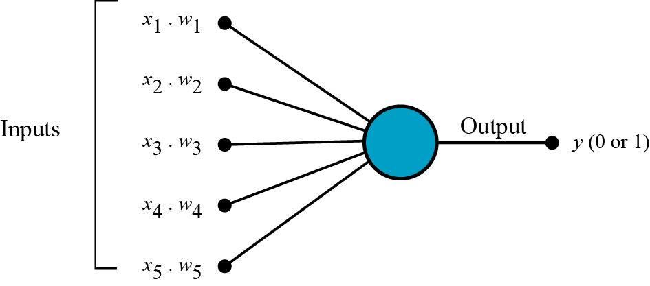

# Deep Learning Fundamentals

## 
 Perceptron Algorithm

The perceptron was introduced by McCulloch and Pitts in 1943 as an
artificial neuron with a hard-limiting activation function $\sigma$.

It works as a binary linear classifier or a linear regressor, the behaviour depends only of the activation function.

## **Equations**

One input signal is constant ( $x_p = 1$) and the weight related to this input is called "bias", commonly represented as $\theta$:
$$ \omega_p = - \theta $$

The input signals and weights can be expressed like an inner product and this relation is called "activation potential" $\nu$:

$$ \nu = \Sigma_{i=1}^{N - 1} x_i \omega_i  = \hat{\omega}_{1:N-1} \cdot \hat{x}_{1:N-1}$$

Considering the bias we can represent this equations like this

$$ \hat{\nu} = \hat{\omega} \cdot \hat{x} = \nu - \theta$$

## **Learning Rules**

The update of weight and bias is simple

$$ w_i = w + \lambda(x_i \epsilon)$$
$$ b = b + \lambda \epsilon$$

Where $\epsilon$ is the difference between the real value and the value obtained by the algoritm ($ y_i - \hat{y}_{pred} $). $\lambda$ is the learning rate (we have to choose a value that better fit the situation).

## **Result**

Using perceptron as a classifier, the activation function returns $0$ when $\nu < \theta$ or $1$ when $\nu \geq \theta$.

____

## Adaline
