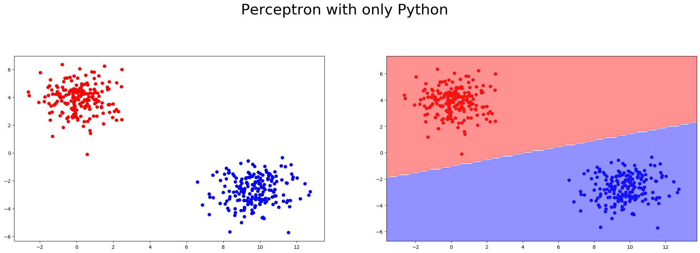
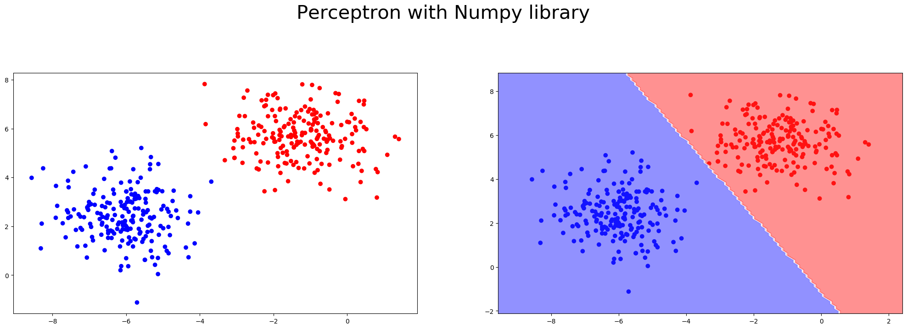

# Results

In the root of this project you can find a brief explanation about the algorithm, now you can see it working.

## Binary Classifier

With the notebook you can change as you like the sample distribution, below there is a result obtained with just python and using numpy to realize the computation in different situations:

## Linear Regressor

Unfortunately there is no data visualization, but in the notebook there is a comparison between Perceptron Linear Regression and Sci Learn Linear Regression and the results are amazing!